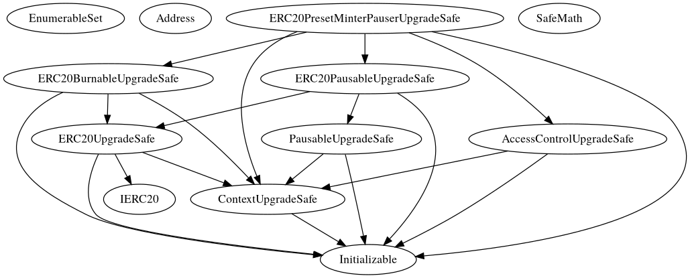
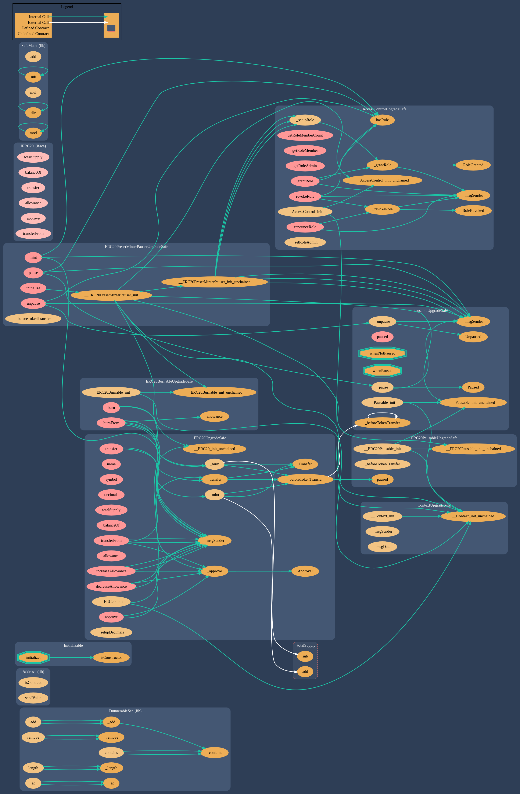

# 2Gether Token (2GT)

## Smart Contracts for the [2Gether](https://www.2gether.global/) Token

### Production Contracts Network Addresses

* Contract Address = [0xC96c1609A1a45CcC667B2b7FA6508e29617f7b69](https://etherscan.io/address/0xC96c1609A1a45CcC667B2b7FA6508e29617f7b69)
* Implementation (logic) = [0xf9E1F413CE99aaF207C9e325EcA93A8Ed2d5FfDf](https://etherscan.io/address/0xf9E1F413CE99aaF207C9e325EcA93A8Ed2d5FfDf)
* ProxyAdmin = [0xDaCAc5E5Fd52Ac1109bEBd561a7DF18702ab6D0c](https://etherscan.io/address/0xDaCAc5E5Fd52Ac1109bEBd561a7DF18702ab6D0c)

### Concerning the contracts:
* We use [openZepplin](https://openzeppelin.com/) upgradable, reusable and secure Smart Contracts 

### InheritanceTree

### Contracts Functions Flow

## Our Token was built with
* [Node.js](https://nodejs.org/en/) - JavaScript runtime 
* [NPM.js](https://www.npmjs.com/) - package manager for Node.js packages
* [Chai](https://chaijs.com/) - javascript testing framework
* [Ethereum](https://www.ethereum.org/) - Decentralized platform for Smart Contract applications 
* [OpenZepplin](https://github.com/OpenZeppelin/zeppelin-solidity) - Reusable and Secure Smart Contracts 
* [Truffle](https://github.com/trufflesuite/truffle) -  Development environment, testing framework and asset pipeline for Ethereum
* [ganache](https://github.com/trufflesuite/ganache-cli) - Node.js based Ethereum client for testing and development
* [Infura](https://infura.io/) - Ethereum API and IPFS API for building Ethereum blockchain applications on a scalable cloud infrastructure with reliable transaction processing.

## Authors

* [2Gether](https://www.2gether.global/) BlockChain Team

## License
Code released under the [MIT License](LICENSE.md).